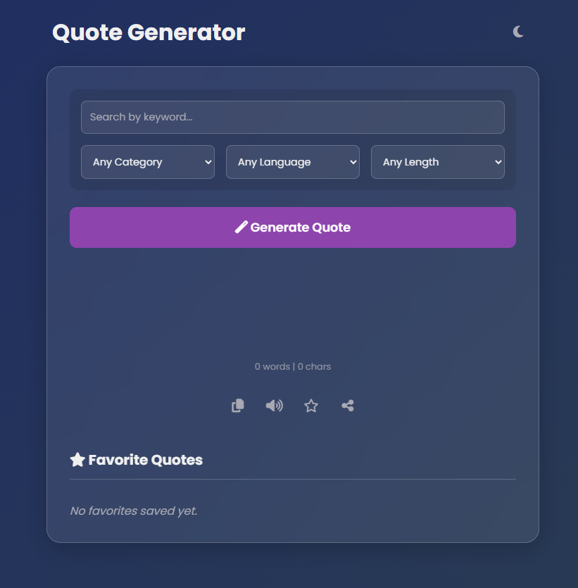
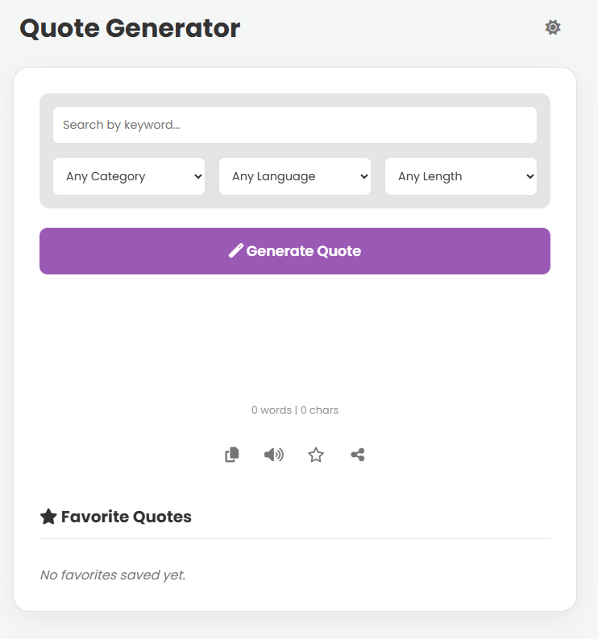

# Free ✨ AI-Powered Quote Generator

[](https://opensource.org/licenses/MIT)
[](https://github.com/aakhalidhruv28/Quote-Generator/stargazers)
[](https://free-ai-quote-generator.netlify.app/)

QuoteSphere is a modern, feature-rich quote generator that leverages the power of AI to create unique and inspiring quotes on demand. With a sleek, responsive design, theme-switching capabilities, and a robust set of user tools, it provides a seamless and enjoyable user experience.

### **[➡️ View the Live Demo](https://free-ai-quote-generator.netlify.app/)**

## 📸 Screenshots

<table width="100%">
  <tr>
    <td width="50%" align="center"><b>Dark Mode 🌙</b></td>
    <td width="50%" align="center"><b>Light Mode ☀️</b></td>
  </tr>
  <tr>
    <td width="50%">
      <!--
        HOW TO ADD YOUR SCREENSHOT:
        1. Take a screenshot of your app in Dark Mode.
        2. Upload it to the root of your GitHub repository.
        3. Replace the placeholder link below with the raw link to your image.
        Example: https://raw.githubusercontent.com/aakhalidhruv28/Quote-Generator/main/dark-mode-screenshot.png
      -->
      
    </td>
    <td width="50%">
      <!--
        HOW TO ADD YOUR SCREENSHOT:
        1. Take a screenshot of your app in Light Mode.
        2. Upload it to the root of your GitHub repository.
        3. Replace the placeholder link below with the raw link to your image.
        Example: https://raw.githubusercontent.com/aakhalidhruv28/Quote-Generator/main/light-mode-screenshot.png
      -->
      
    </td>
  </tr>
</table>

## 📜 Table of Contents

- [Features](#-features)
- [🛠️ Technologies Used](#️-technologies-used)
- [🚀 Getting Started](#-getting-started)
- [🔑 Setting Up the OpenRouter API](#-setting-up-the-openrouter-api)
- [💡 How to Use](#-how-to-use)
- [📝 License](#-license)
- [👤 Contact](#-contact)

## ✨ Features

- **AI-Powered Generation**: Utilizes the **OpenRouter AI API** (with Llama 3) to generate unique quotes based on user input.
- **Advanced Customization**: Filter quote generation by:
  - **Keyword**: Get a quote about a specific topic (e.g., "success", "nature").
  - **Category**: Choose from styles like Motivational, Funny, Love, etc.
  - **Language**: Generate quotes in English, Spanish, Hindi, and French.
  - **Length**: Specify short, medium, or long quotes.
- **Modern UI/UX**:
  - A beautiful glassmorphism/neumorphism design that feels fresh and modern.
  - **Toast Notifications**: Non-disruptive feedback for actions like "Copied" or "Saved".
  - **Interactive Buttons**: Buttons provide visual feedback, such as showing a loader during generation or a checkmark on copy.
- **Dark & Light Themes**: Toggle between themes with a click. Your preference is saved in `localStorage` for future visits.
- **Responsive Design**: Flawless experience across desktops, tablets, and mobile devices.
- **Quote Actions**:
  - **Copy to Clipboard**: Easily copy the full quote with a robust function that works across all modern browsers.
  - **Text-to-Speech**: Listen to the quote being read aloud.
  - **Share**: Use the native Web Share API on mobile or a Twitter fallback on desktop.
- **Favorites System**:
  - **Save & Remove**: Save your favorite quotes, which are stored locally in your browser.
  - **View Favorites**: A clean, scrollable list displays all your saved quotes.
  - **Export Favorites**: Download all your saved quotes as a `.txt` file.
- **Quote Metadata**: Instantly see the word and character count for each generated quote.

## 🛠️ Technologies Used

- **Frontend**: HTML5, CSS3, Vanilla JavaScript (ES6+)
- **APIs**:
  - [OpenRouter AI API](https://openrouter.ai/) for quote generation.
  - [Web Speech API](https://developer.mozilla.org/en-US/docs/Web/API/Web_Speech_API) (SpeechSynthesis) for text-to-speech.
  - [Web Share API](https://developer.mozilla.org/en-US/docs/Web/API/Web_Share_API) for sharing functionality.
- **Styling**:
  - CSS Custom Variables for easy theming.
  - Flexbox and CSS Grid for responsive layouts.
- **Fonts & Icons**:
  - [Google Fonts](https://fonts.google.com/) (Poppins)
  - [Font Awesome](https://fontawesome.com/) for icons.

## 🚀 Getting Started

To get a local copy up and running, follow these simple steps.

1.  **Clone the repository:**
    ```bash
    git clone https://github.com/aakhalidhruv28/Quote-Generator.git
    ```
2.  **Navigate to the project directory:**
    ```bash
    cd Quote-Generator
    ```
3.  **Get your API Key:**
    Follow the instructions in the [Setting Up the OpenRouter API](#-setting-up-the-openrouter-api) section below to get your free API key.

4.  **Add your API Key:**
    Open the `script.js` file and replace the placeholder with your key:
    ```javascript
    const apiKey = "YOUR_API_KEY_HERE";
    ```
5.  **Open in Browser:**
    Open the `index.html` file in your browser. For the best experience (and for the Copy/Share APIs to work correctly), it's recommended to use a live server.
    - If you use VS Code, you can install the [Live Server extension](https://marketplace.visualstudio.com/items?itemName=ritwickdey.LiveServer) and click "Go Live" from the bottom bar.

## 🔑 Setting Up the OpenRouter API

This project uses **OpenRouter.ai** to access powerful language models for free. Follow these steps to get your own API key:

1.  **Create an Account**: Go to [OpenRouter.ai](https://openrouter.ai/) and sign up for a free account. You get free credits upon signing up, which are more than enough for personal projects.

2.  **Go to Keys**: Once logged in, click on your profile icon in the top right and select **"Keys"**.

3.  **Create a New Key**: Click the **"+ Create Key"** button. Give it a name (e.g., "QuoteGeneratorProject") and click "Create".

4.  **Copy Your Key**: Your new API key will be displayed. It will look something like `sk-or-v1-abc...xyz`. Click the copy icon.

5.  **Add to Project**: Paste this key into the `script.js` file as described in the "Getting Started" section.

> **⚠️ Important Security Note**: Never commit your API keys to a public GitHub repository. For a real-world application, use environment variables to keep your keys safe. This project includes the key directly for simplicity of demonstration.

## 💡 How to Use

Using QuoteSphere is intuitive and straightforward.

1.  **Generate a Basic Quote**: Simply click the **"Generate Quote"** button to get a random, inspiring quote.

2.  **Generate a Custom Quote**: Use the filter controls to tailor the AI's response. For example, to get a funny quote about happiness in Hindi, you would:
    - Type `happiness` in the search bar.
    - Select `Funny` from the Category dropdown.
    - Select `Hindi` from the Language dropdown.
    - The AI will use the following prompt:
      ```
      Give me a creative, unique quote about 'happiness' in the category 'Funny' in Hindi language.
      ```

3.  **Use the Action Buttons**:
    - **Copy**: Click the copy icon to save the quote and author to your clipboard.
    - **Speak**: Click the volume icon to have the quote read to you.
    - **Save**: Click the star icon to add the quote to your favorites. The star will become solid to indicate it's saved. Click it again to remove it.
    - **Share**: Click the share icon to open your device's share menu or a Twitter link.

4.  **Manage Favorites**:
    - Scroll down to the "Favorite Quotes" section to see your saved items.
    - Click the trash can icon next to any quote to remove it from the list.
    - Click **"Export as TXT"** to download a text file of all your saved quotes.

## 📝 License

This project is distributed under the MIT License. See the `LICENSE` file for more information.

```
MIT License

Copyright (c) 2023 Dhruv Aakhali

Permission is hereby granted, free of charge, to any person obtaining a copy
of this software and associated documentation files (the "Software"), to deal
in the Software without restriction, including without limitation the rights
to use, copy, modify, merge, publish, distribute, sublicense, and/or sell
copies of the Software, and to permit persons to whom the Software is
furnished to do so, subject to the following conditions:

The above copyright notice and this permission notice shall be included in all
copies or substantial portions of the Software.

THE SOFTWARE IS PROVIDED "AS IS", WITHOUT WARRANTY OF ANY KIND, EXPRESS OR
IMPLIED, INCLUDING BUT NOT LIMITED TO THE WARRANTIES OF MERCHANTABILITY,
FITNESS FOR A PARTICULAR PURPOSE AND NONINFRINGEMENT. IN NO EVENT SHALL THE
AUTHORS OR COPYRIGHT HOLDERS BE LIABLE FOR ANY CLAIM, DAMAGES OR OTHER
LIABILITY, WHETHER IN AN ACTION OF CONTRACT, TORT OR OTHERWISE, ARISING FROM,
OUT OF OR IN CONNECTION WITH THE SOFTWARE OR THE USE OR OTHER DEALINGS IN THE
SOFTWARE.
```

## 👤 Contact

Created by **Dhruv Aakhali**

- **GitHub**: [@aakhalidhruv28](https://github.com/aakhalidhruv28)

---
